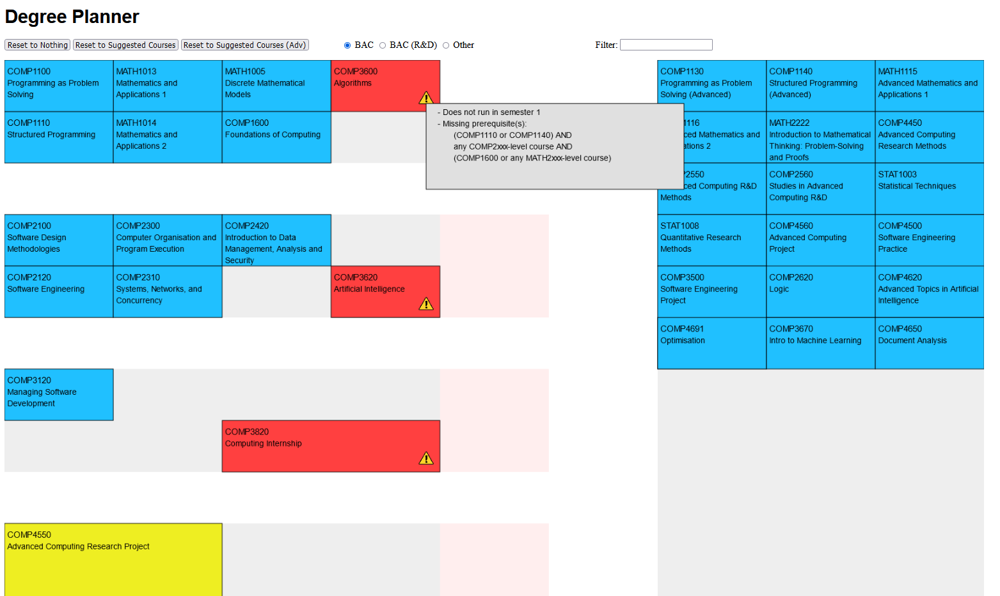

# Degree Planner #

A simple degree planner for a subset of COMP courses (and some MATH and STAT). It shows warnings
if a course cannot be placed at a given position (e.g. if it is missing a prerequisite, or doesn't
run in that semester). Hovering over the warning icon shows the prerequisites which have not yet been
satisfied.

TODO: more courses, better searching, ensure it actually works for complex prerequisites

[Click here](https://alexdboxall.github.io/Degree-Planner/) to open the project in your browser...

